# Water Potability Analysis App 💧

A comprehensive machine learning application for analyzing water quality parameters and predicting water potability using advanced data science techniques.

## 🌟 Overview

This Streamlit-based application provides an end-to-end solution for water quality analysis, from data exploration to machine learning model deployment. The app helps users understand water quality patterns, preprocess data effectively, and make accurate potability predictions using state-of-the-art machine learning algorithms.

***

**[Link to live Streamlit app]()**

This is the Milestone Project for Predictive Analytics section of the Full Stack Developer Course taught through Code Institute
***

## Dataset Content

* The dataset for this project is sourced from **[Kaggle](https://www.kaggle.com/code/nimapourmoradi/water-potability)**.

* The dataset for this project uses water quality data with 3,276 samples, covering 9 physicochemical properties (e.g., pH, chloramines, turbidity) and a binary potability label. It includes measurements like hardness (mg/L) and total dissolved solids (ppm), with some missing values handled during preprocessing. The data helps predict drinkability and identify contamination risks, though it excludes microbial testing. Ideal for public health research and water safety monitoring.

***

### Key Metrics Included

|Category|Metrics|Unit|Relevance to Potability|
|:----|:----|:----|:----|
|Basic Properties|pH, Hardness, Turbidity|pH scale, mg/L, NTU|Directly impacts safety and taste.|
|Chemical Content|Chloramines, Sulfate, TDS|ppm, mg/L|High levels indicate contamination.|
|Organic Matter|Organic Carbon, Trihalomethanes|ppm, ppb|Linked to disinfection byproducts.|
|Electrical Traits|Conductivity|μS/cm|Correlates with dissolved ions.|
|Target Variable|Potability (0=Unsafe, 1=Safe)|Binary|WHO drinking water standards.|
***

### Data Characteristics

* Temporal Coverage: Single snapshot (timestamps optional if your data includes them).

* Missing Values:
    * ph (15% missing), Sulfate (24% missing), Trihalomethanes (5% missing).
    * Handled via imputation or deletion in preprocessing.py.

* Class Distribution:
    * Potable (Safe): 61% of samples.
    * Non-Potable: 39% of samples.

## Business Requirements

* *For clarity, this is an education-based project, and the organization described is for illustrative purposes.*

* **AquaSafe Analytics**, a water quality consultancy, faces challenges in helping governments and NGOs monitor drinking water safety efficiently. Currently, analysts manually assess water quality reports from disparate sources, spending hours compiling data to identify contamination risks and compliance with safety standards. This slow, error-prone process delays critical interventions, especially in regions with aging infrastructure or environmental stressors. With varying water quality challenges across urban and rural areas, a scalable solution is needed to standardize assessments and predict potability in real time.

* **AquaSafe Analytics** has requested a user-friendly, cost-effective tool to automate water quality analysis. During planning, the data science team proposed a Streamlit-based application leveraging interactive visualizations, statistical analysis, and machine learning. This solution would enable:
   * Rapid identification of unsafe water sources using key metrics (pH, turbidity, chemical levels).

   * Predictive modeling to flag high-risk areas before contamination spreads.

   * Data-driven recommendations for infrastructure upgrades or treatment interventions.

* The tool’s success could extend to global datasets or integrate with IoT sensors for live monitoring.

## Hypothesis and how to validate

## Machine Learning Business Case

* We aim to develop a binary classification model to predict water potability (safe/unsafe) using physicochemical properties from water quality datasets. This solution will enable governments and NGOs to proactively identify contamination risks and allocate resources efficiently.

* Ideal Outcomes
    * Model Performance:
        * Accuracy ≥ 90% and F1-score ≥ 0.88 on the test set.
        * Outperform traditional rule-based methods (e.g., WHO threshold checks) by at least 20% in precision.
    * Business Impact:
        * Reduce manual testing costs by 30% through prioritized sampling.
        * Cut decision-making time from days to minutes for contamination responses.

* Model Capabilities
* 1 - Input: Water quality metrics (pH, turbidity, chloramines, etc.).
* 2 - Output:
    * Binary prediction (0 = Unsafe, 1 = Safe).
    * Probability score and risk factors (e.g., "High trihalomethanes detected").
* 3 - User Interaction:
    * Streamlit app allows input of custom water samples for instant predictions.
    * Visualizations of feature importance (e.g., "pH contributes 25% to potability").

* The model is trained on the Kaggle Water Potability Dataset, containing 3,276 samples with 9 physicochemical features. Global coverage (urban/rural, diverse water sources) and Missing data: Handled via imputation during preprocessing.

## Dashboard Design - Streamlit app

### Data Source

* You can use the example dataset or upload your own dataset depending on your preference.

### Page 1 - Data Overview

Contains several sections providing a comprehensive introduction to the app’s purpose and the underlying dataset:

- **Quick Project Summary**: A concise overview of what the project entails and its key features.
- **Dataset**: The dataset includes water quality metrics such as pH, Hardness, Solids, and Potability. 
- **Dataset Types**: Displays the dataset types to enable users grasp the scope of data.
- **Target Distribution**: Presents a pie chart percentage of potable and not potable water.
- **Summary Statistics**: Presents summary statistics (e.g., mean, count, std, min, max etc) for numeric columns, providing insights into the data’s variability.
- **README Link**: Offers a link to the project’s README for in-depth methodologies and findings.

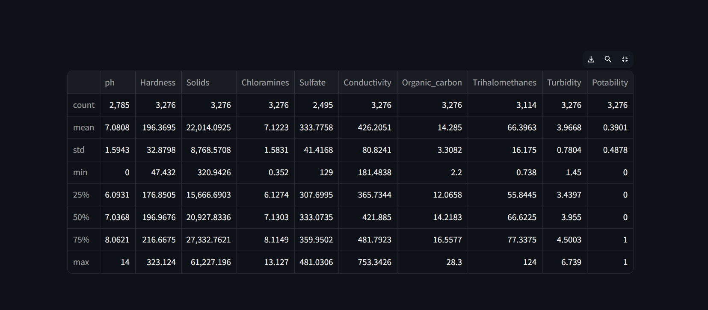
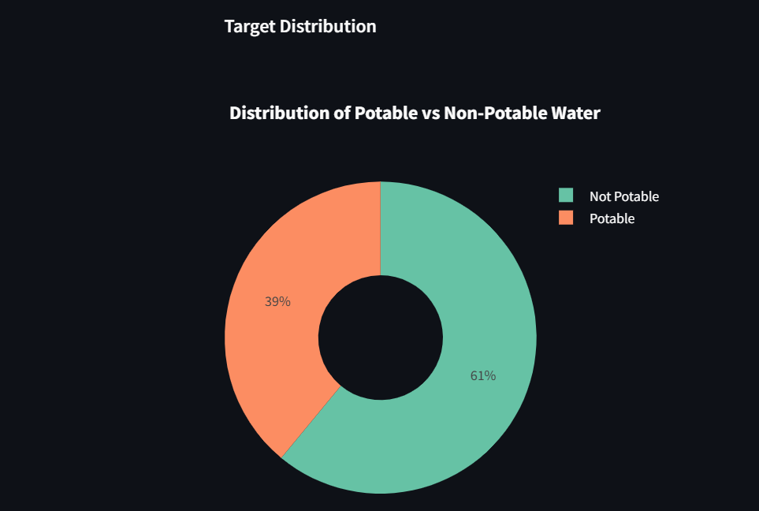
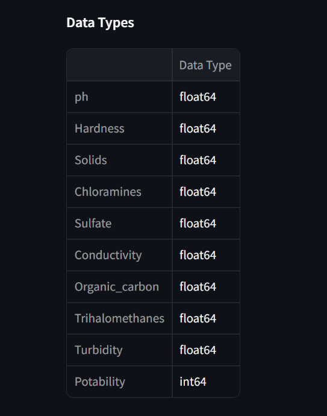

### Page 2 - Data Preprocessing

This section handles data preprocessing including missing values, outliers, feature engineering, and scaling.

- **Imputation Handling**: Provide buttons for selecting imputation methods which are mean, median, drop rows and custom value.
- **Outlier Handling**: Provide buttons to select method for handling outliers.
- **Feature Scaling**: Provide buttons to select scaling method.
- **README Link**: Offers a link to the project’s README for in-depth methodologies and findings.
- **Data Preprocessing details is found in other pages of the streamlit app.**

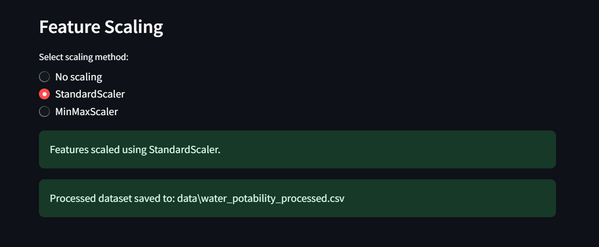

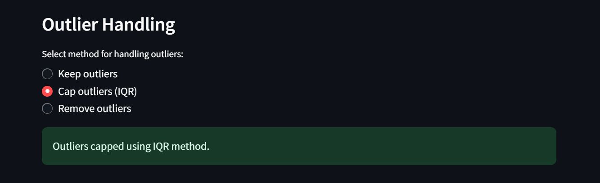

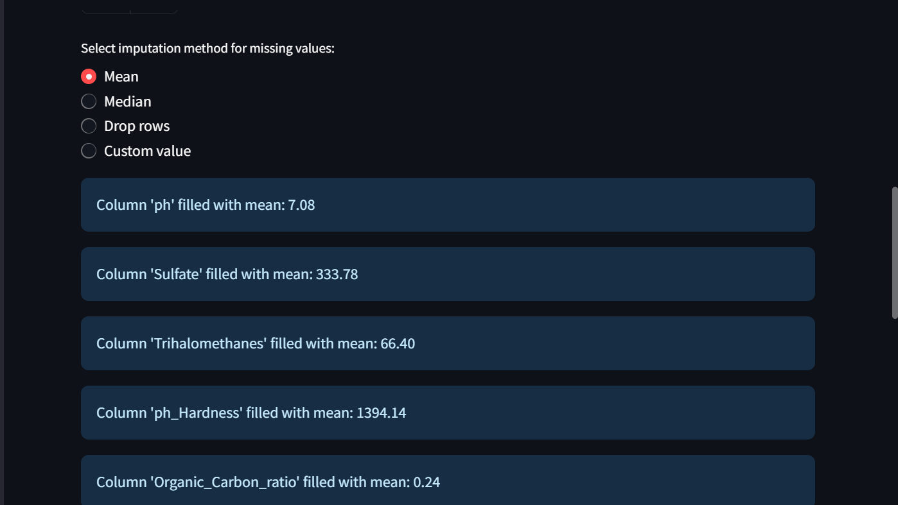

### Page 3 - Exploratory Data Analysis

This section performs exploratory data analysis with visualizations:

- **Feature Distribution**: A histogram and box plot section that displays the distributions of dataset.
- **Correlation Analysis**: A matrix that correlates datasets features.
- **Statistical Significance (T-tests)**: A table that has dataset features and p-value.
- **Feature Relationships with Potability**: Allows users to select features to compare with potability.
- **Pairwise Feature Relationships**: Select features for pairplot maximum of 4 features recommended for pairing.
- **README Link**: Offers a link to the project’s README for in-depth methodologies and findings.

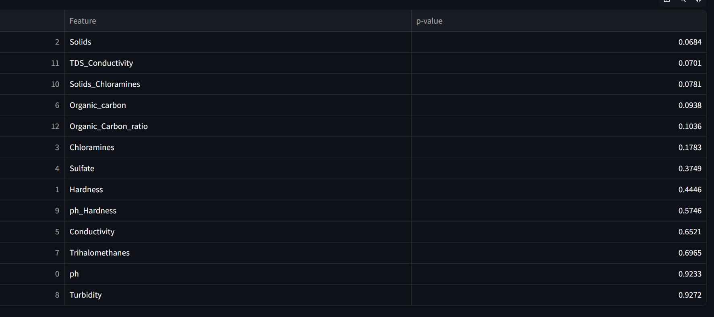

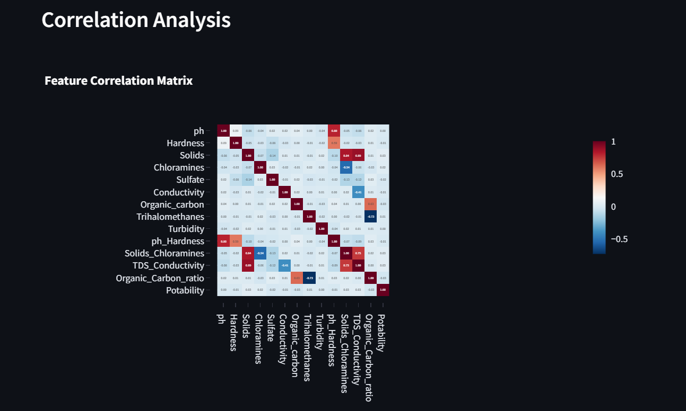

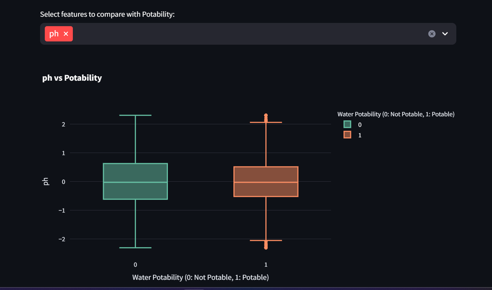

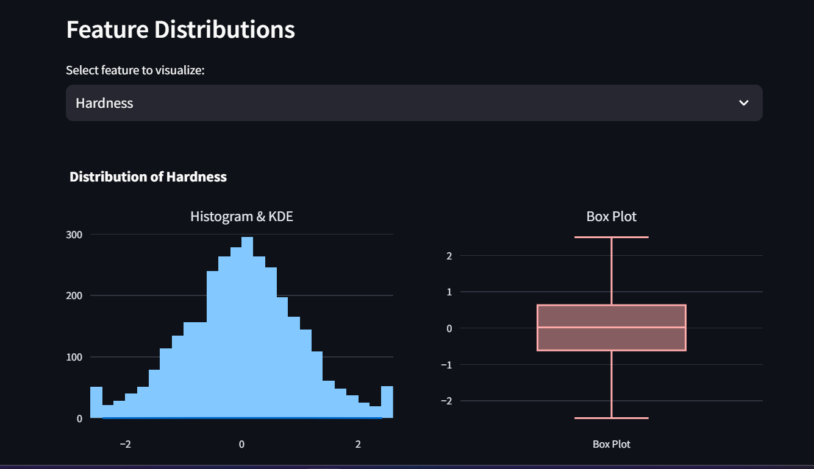

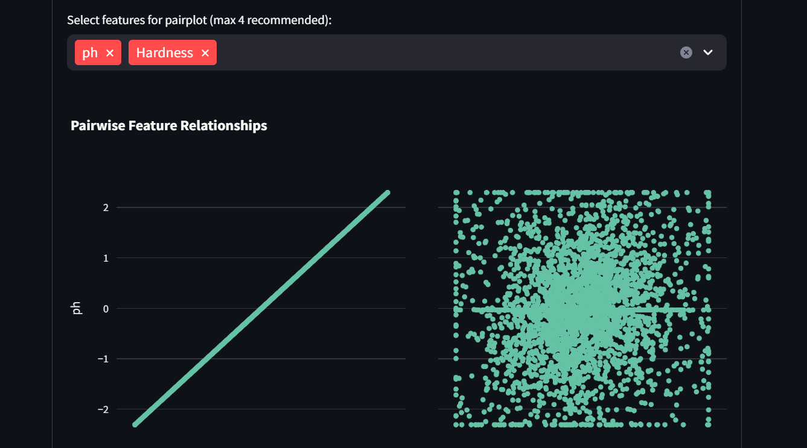

### Page 4 - Feature Importance Analysis

This section analyze feature importance using Random Forest and correlation:

- **Random Forest Feature Importance**: Contains a section that correlates dataset features importance in Random forest.
- **README Link**: Offers a link to the project’s README for in-depth methodologies and findings.

### Page 5 - Model Building and Evaluation

This section builds and evaluate machine learning models for water potability prediction:

- **Train-Test Split**: A slider to select test set size in a scale of 10 to 40 in percentage.
- **Model Selection**: A dropdown list that gives options to select models to evaluate.
- **Cross-Validation Results**: Result of selected models evaluated in tabular and bar chart form.
- **Best Model Evaluation**: A dropdown list that gives options to select models for detailed evaluation.
- **Confusion Matrix**: A chart of actual versus predicted potable and not potable water.
- **ROC Curve**
- **README Link**: Offers a link to the project’s README for in-depth methodologies and findings.

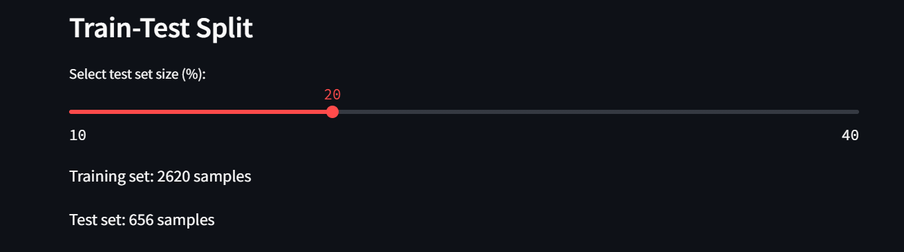

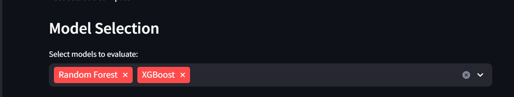

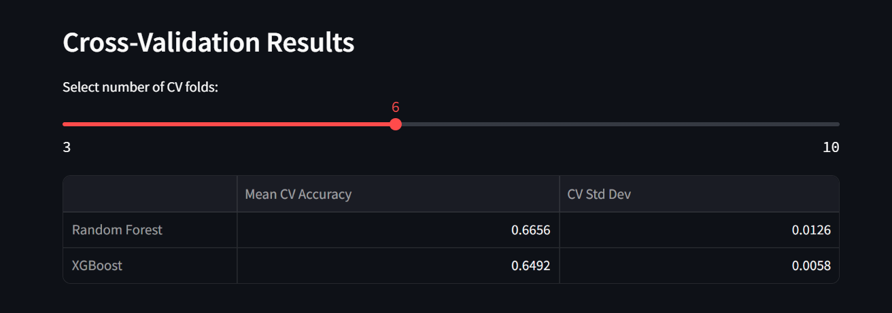

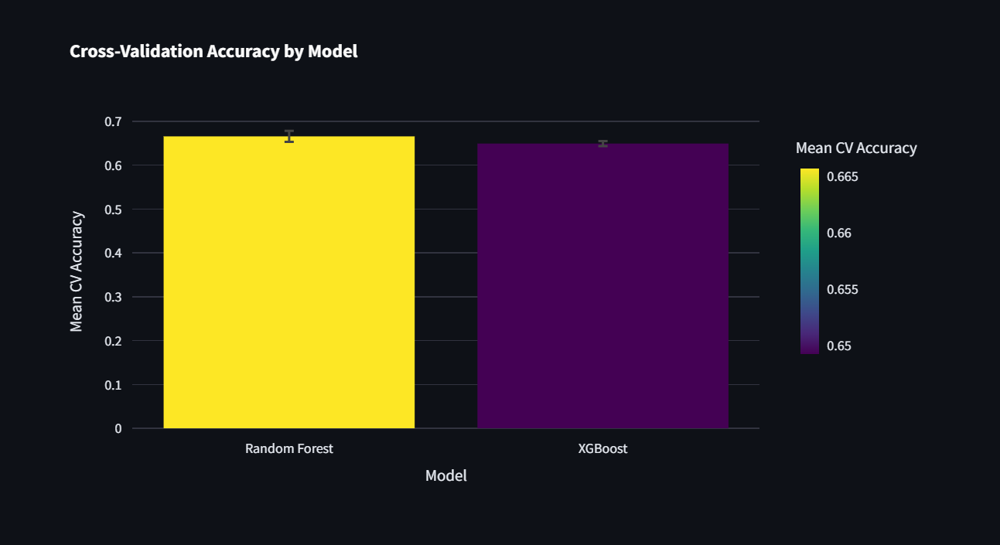

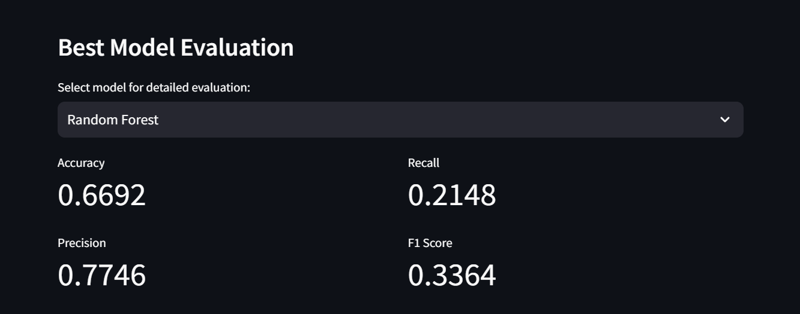

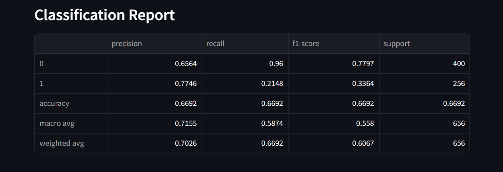

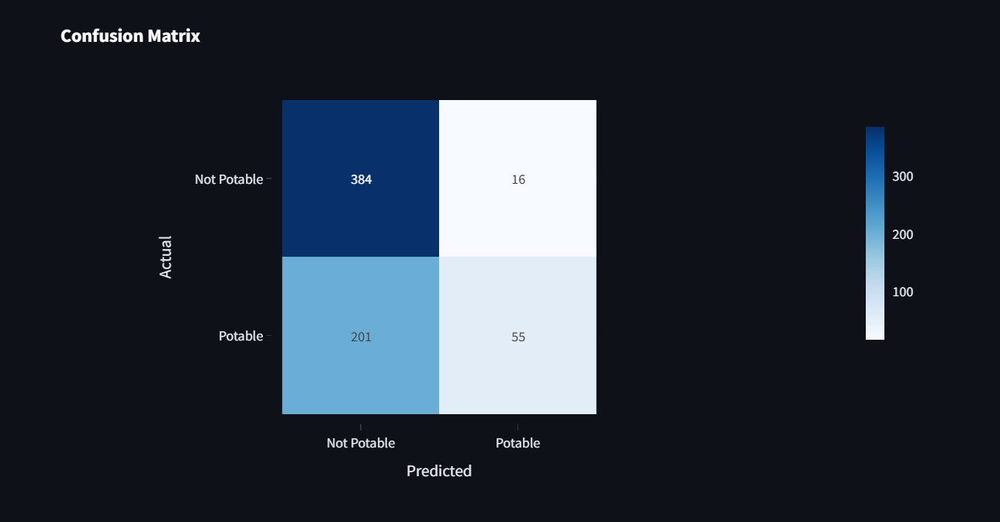

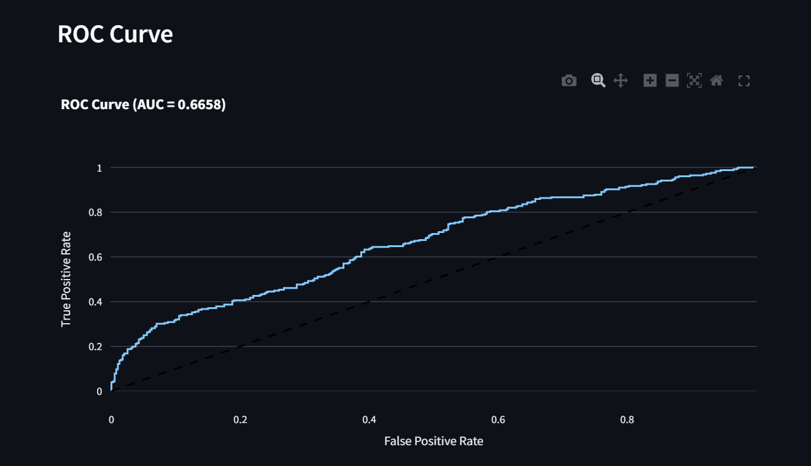

