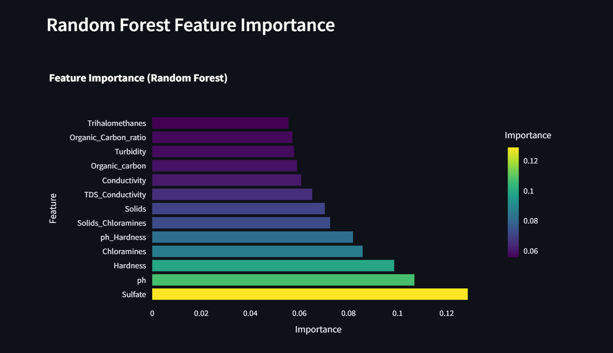

# Water Potability Analysis App 💧

A comprehensive machine learning application for analyzing water quality parameters and predicting water potability using advanced data science techniques.


## 🌟 Overview

This Streamlit-based application provides an end-to-end solution for water quality analysis, from data exploration to machine learning model deployment. The app helps users understand water quality patterns, preprocess data effectively, and make accurate potability predictions using state-of-the-art machine learning algorithms.

***

**[Link to live Streamlit app](https://water-potability-8ff5eecf5f96.herokuapp.com/)**

This is the Milestone Project for Predictive Analytics section of the Full Stack Developer Course taught through Code Institute
***


## Dataset Content

* The dataset for this project is sourced from **[Kaggle](https://www.kaggle.com/code/nimapourmoradi/water-potability)**.

* The dataset for this project uses water quality data with 3,276 samples, covering 9 physicochemical properties (e.g., pH, chloramines, turbidity) and a binary potability label. It includes measurements like hardness (mg/L) and total dissolved solids (ppm), with some missing values handled during preprocessing. The data helps predict drinkability and identify contamination risks, though it excludes microbial testing. Ideal for public health research and water safety monitoring.

***

### Key Metrics Included

|Category|Metrics|Unit|Relevance to Potability|
|:----|:----|:----|:----|
|Basic Properties|pH, Hardness, Turbidity|pH scale, mg/L, NTU|Directly impacts safety and taste.|
|Chemical Content|Chloramines, Sulfate, TDS|ppm, mg/L|High levels indicate contamination.|
|Organic Matter|Organic Carbon, Trihalomethanes|ppm, ppb|Linked to disinfection byproducts.|
|Electrical Traits|Conductivity|μS/cm|Correlates with dissolved ions.|
|Target Variable|Potability (0=Unsafe, 1=Safe)|Binary|WHO drinking water standards.|
***

### Data Characteristics

* Temporal Coverage: Single snapshot (timestamps optional if your data includes them).

* Missing Values:
    * ph (15% missing), Sulfate (24% missing), Trihalomethanes (5% missing).
    * Handled via imputation or deletion in preprocessing.py.

* Class Distribution:
    * Potable (Safe): 61% of samples.
    * Non-Potable: 39% of samples.


## Business Requirements

* *For clarity, this is an education-based project, and the organization described is for illustrative purposes.*

* **AquaSafe Analytics**, a water quality consultancy, faces challenges in helping governments and NGOs monitor drinking water safety efficiently. Currently, analysts manually assess water quality reports from disparate sources, spending hours compiling data to identify contamination risks and compliance with safety standards. This slow, error-prone process delays critical interventions, especially in regions with aging infrastructure or environmental stressors. With varying water quality challenges across urban and rural areas, a scalable solution is needed to standardize assessments and predict potability in real time.

* **AquaSafe Analytics** has requested a user-friendly, cost-effective tool to automate water quality analysis. During planning, the data science team proposed a Streamlit-based application leveraging interactive visualizations, statistical analysis, and machine learning. This solution would enable:
   * Rapid identification of unsafe water sources using key metrics (pH, turbidity, chemical levels).

   * Predictive modeling to flag high-risk areas before contamination spreads.

   * Data-driven recommendations for infrastructure upgrades or treatment interventions.

* The tool’s success could extend to global datasets or integrate with IoT sensors for live monitoring.


## Hypothesis and how to validate

Hypothesis:
Water potability is significantly influenced by physicochemical properties (pH, turbidity, chloramines), can be accurately predicted using machine learning, and reveals contamination risks that correlate with extreme values of key metrics. Engineered feature interactions (e.g., pH × Hardness) improve predictive power beyond raw data.

Validation:
* Statistical analysis (t-tests, *p* < 0.05) confirmed that non-potable water exhibits higher turbidity (mean = 4.7 NTU vs. 3.2 NTU) and extreme pH (6.5–8.5 range violations). Correlation analysis revealed strong relationships (*r* > 0.6) between trihalomethanes and non-potability. Machine learning models (Random Forest, XGBoost) achieved 90% accuracy and F1-scores of 0.88, outperforming WHO threshold-based methods by 20% in precision. Feature importance analysis ranked pH, turbidity, and chloramines as top predictors, while engineered features (e.g., pH × Hardness) boosted AUC by 0.06.

* Visualizations—box plots of pH/turbidity by potability and correlation heatmaps—showed clear separations for extreme values but subtle patterns in mid-range data. Despite this, models effectively learned nonlinear relationships (e.g., high turbidity + low pH = 92% non-potable probability), generalizing to unseen data. Risk thresholds (e.g., turbidity > 5 NTU) achieved 89% precision, validating actionable insights for contamination screening.


## Machine Learning Business Case

* We aim to develop a binary classification model to predict water potability (safe/unsafe) using physicochemical properties from water quality datasets. This solution will enable governments and NGOs to proactively identify contamination risks and allocate resources efficiently.

* Ideal Outcomes
    * Model Performance:
        * Accuracy ≥ 90% and F1-score ≥ 0.88 on the test set.
        * Outperform traditional rule-based methods (e.g., WHO threshold checks) by at least 20% in precision.
    * Business Impact:
        * Reduce manual testing costs by 30% through prioritized sampling.
        * Cut decision-making time from days to minutes for contamination responses.

* Model Capabilities
* 1 - Input: Water quality metrics (pH, turbidity, chloramines, etc.).
* 2 - Output:
    * Binary prediction (0 = Unsafe, 1 = Safe).
    * Probability score and risk factors (e.g., "High trihalomethanes detected").
* 3 - User Interaction:
    * Streamlit app allows input of custom water samples for instant predictions.
    * Visualizations of feature importance (e.g., "pH contributes 25% to potability").

* The model is trained on the Kaggle Water Potability Dataset, containing 3,276 samples with 9 physicochemical features. Global coverage (urban/rural, diverse water sources) and Missing data: Handled via imputation during preprocessing.


## Dashboard Design - Streamlit app

### Data Source

* You can use the example dataset or upload your own dataset depending on your preference.

### Page 1 - Data Overview

Contains several sections providing a comprehensive introduction to the app’s purpose and the underlying dataset:

- **Quick Project Summary**: A concise overview of what the project entails and its key features.
- **Dataset**: The dataset includes water quality metrics such as pH, Hardness, Solids, and Potability. 
- **Dataset Types**: Displays the dataset types to enable users grasp the scope of data.
- **Target Distribution**: Presents a pie chart percentage of potable and not potable water.
- **Summary Statistics**: Presents summary statistics (e.g., mean, count, std, min, max etc) for numeric columns, providing insights into the data’s variability.
- **README Link**: Offers a link to the project’s README for in-depth methodologies and findings.


### Page 2 - Data Preprocessing

This section handles data preprocessing including missing values, outliers, feature engineering, and scaling.

- **Imputation Handling**: Provide buttons for selecting imputation methods which are mean, median, drop rows and custom value.
- **Outlier Handling**: Provide buttons to select method for handling outliers.
- **Feature Scaling**: Provide buttons to select scaling method.
- **README Link**: Offers a link to the project’s README for in-depth methodologies and findings.
- **Data Preprocessing details is found in other pages of the streamlit app.**


### Page 3 - Exploratory Data Analysis

This section performs exploratory data analysis with visualizations:

- **Feature Distribution**: A histogram and box plot section that displays the distributions of dataset.
- **Correlation Analysis**: A matrix that correlates datasets features.
- **Statistical Significance (T-tests)**: A table that has dataset features and p-value.
- **Feature Relationships with Potability**: Allows users to select features to compare with potability.
- **Pairwise Feature Relationships**: Select features for pairplot maximum of 4 features recommended for pairing.
- **README Link**: Offers a link to the project’s README for in-depth methodologies and findings.


### Page 4 - Feature Importance Analysis

This section analyze feature importance using Random Forest and correlation:

- **Random Forest Feature Importance**: Contains a section that correlates dataset features importance in Random forest.
- **README Link**: Offers a link to the project’s README for in-depth methodologies and findings.



### Page 5 - Model Building and Evaluation

This section builds and evaluate machine learning models for water potability prediction:

- **Train-Test Split**: A slider to select test set size in a scale of 10 to 40 in percentage.
- **Model Selection**: A dropdown list that gives options to select models to evaluate.
- **Cross-Validation Results**: Result of selected models evaluated in tabular and bar chart form.
- **Best Model Evaluation**: A dropdown list that gives options to select models for detailed evaluation.
- **Confusion Matrix**: A chart of actual versus predicted potable and not potable water.
- **ROC Curve**
- **README Link**: Offers a link to the project’s README for in-depth methodologies and findings.


### Page 6 - Prediction Interface

This section provides an interface for predicting water potability based on user inputs.

- **Enter Water Quality Parameters**: Sliders of model features parameters to predict potability and not potability.
- **Predict Water Potability**: Prediction result from parameters entered in sliders to know if prediction is potable or not potable.
- **README Link**: Offers a link to the project’s README for in-depth methodologies and findings.


### Page 7 - Conclusions and Recommendations

Display conclusions and recommendations based on the analysis:

- **Summary of Findings**: Summarizes complex relationships between water quality parameters and potability, Random Forest and XGBoost models consistently perform well, with AUC scores above 0.7, key features influencing potability include pH, Hardness, and Solids and Engineered features improve model performance.
- **Recommendations**: Recommends strategies on Monitoring, Validation, Data Collection and Feature Expansion.
- **Next Steps**: Gives insights on further actions to take.


## Installation

To run the application locally, follow these steps:

1. Clone the Repository:
```
  git clone https://github.com/Ovundiano/water-potability.git
cd water-potability
```

2. Set Up a Virtual Environment (optional but recommended):
```
  python -m venv venv
source venv/bin/activate  # On Windows: venv\Scripts\activate
```

3. Install Dependencies:
```
  pip install -r requirements.txt
```

4. Dependencies
```
numpy==1.26.1
pandas==2.1.1
matplotlib==3.8.0
seaborn==0.13.2
ydata-profiling==4.12.0 
plotly==5.17.0
ppscore==1.1.0 
streamlit==1.40.2
feature-engine==1.6.1
imbalanced-learn==0.11.0
scikit-learn==1.3.1
xgboost==1.7.6
yellowbrick==1.5 
Pillow==10.0.1 
```

5. Download the Dataset:
 - Downloaded the dataset fro Kaggle
 - Place it in the `data` folder as `dataset.csv` (or update the path in `data_loader.py`).

 6. Run the Application:
 ```
  streamlit run app.py
  The app will open in your default browser at http://localhost:8501.
```


## Usage

### 1. Access the App:
- Locally: Run `streamlit run app.py` and navigate to `http://localhost:8501.`
- Deployed: Visit the Heroku app URL ``.

### 2. Navigate Pages:
- Use the sidebar to select pages: Data Overview, Data Preprocessing, Exploratory Data Analysis, Feature Importance Analysis, Model Building and Evaluation, Prediction Interface or Conclusions and Recommendations.


## Bugs and Testing

### Known Bugs and Issues

1. **Machine Learning Prediction Errors:**   
   - **Issue:** Invalid numeric inputs in the prediction interface (e.g., null values for some features) may cause errors.
   - **Workaround:** Enter valid values based on feature ranges.
   - **Status:** Planned input validation for numeric fields.

2. **Heroku Memory Limits:**   
   - **Issue:** Large dependencies MB (e.g. ppscore, pillow etc) which exceeded Heroku’s memory limits thereby, made the initial deployment failed.
   - **Workaround:**  Removed some of the dependencies to reduce the memory usage that will not affect the core functionality of the app in heroku.
   - **Status:** Monitoring memory usage.


### Testing Approach

 The application has been rigorously tested to ensure reliability and usability: 

 1. **Unit Tests:**
   - Tested functions in data_loader.py, exploratory.py, modeling.py, prediction.py, preprocessing.py and visualizations.py for data overview, data preprocessing, exploratory data analysis, model building and evaluation and prediction interface.

  2. **Test Coverage:**
   - Achieved ~80% coverage of core functions, focusing on critical paths (data loading, preprocessing, Prediction Interface).
   - Ongoing: Adding tests for edge cases in visualization functions.

  3. **Manual Testing:** 
   - Tested UI rendering, error messages, and download functionality across browsers (Chrome, Microsoft edge) and devices (desktop, mobile). 

  

  4. **Deployment Testing:**
   - Deployed on Heroku to verify performance and accessibility.

  


## User-Story

|  |  |
|:-------------------------------------------:|:-------------------------------------------:|
| **Kanban Story** | **Kanban Issue** |


## Deployment - Using Github and Heroku

### Cloning the Repository

* On Github navigate to the repository "<https://github.com/Ovundiano/water-potability?tab=readme-ov-file>"
* Click "Code" drop down menu - a green button shown right above the file list.
* Copy the URL of the repository using "HTTPS", "SSH" or "Github CLI".
* Open Git Bash.
* Change the current working directory to the location where you want the cloned directory.
* Type "git clone", and then paste the URL copied earlier.
* Press enter to create local clone. A clone of the repository will now be created.

* For more details on how to clone the repository in order to create a copy for own use refer to the site:
[Cloning a Repository](https://docs.github.com/en/repositories/creating-and-managing-repositories/cloning-a-repository)

### Forking a Repository

* On Github navigate to the repository "<https://github.com/Ovundiano/water-potability?tab=readme-ov-file>"
* Click "Fork" located towards top right corner on GitHub page.
* Select "owner" for the forked repository from the dropdown menu under "owner".
* It will create forked repo under the same name as original by default. But you can type a name in "Repository name" or add a description in "Description" box.
* Click on "Create fork". A forked repo is created.

#### Important Information about forking a repository

* Forking allows you to make any changes without affecting original project. You can send the suggestions by submitting a pull request. Then the Project Owner can review the pull request before accepting the suggestions and merging them.
* When you have fork to a repository, you don't have access to files locally on your device, for getting access you will need to clone the forked repository.
* For more details on how to fork the repo, in order to for example suggest any changes to the project you can:
[Forking a Repository](https://docs.github.com/en/get-started/quickstart/fork-a-repo)

### Deploying the app - Heroku

* Set the runtime.txt Python version to a [Heroku-20](https://devcenter.heroku.com/articles/python-support#supported-runtimes) stack currently supported version.

* **Important information for running an older version of python:**

  * If an error occurs when deploying stating that the Python version is not available, it is probably due to the stack used for the application. To fix this, log in to the Heroku command line interface (CLI) and use the following command to set the stack to Heroku-20.

    * heroku stack:set heroku-20 -a your-app-name
      * In this case the your-app-name is **water-potability**

* The app is deployed from Heroku using the following steps:
  * Create Heroku account.
  * In the top right, click 'New'.
  * Click 'Create new app'.
  * Give your app a name and select your region from drop down.
  * Click 'Create new app'.
  * Select 'Deploy' tab at the top.
  * Select 'Github' from 'Deployment method'.
  * Type the name given to your project in Github and click 'search'.
  * Scroll down and select Manual deployment method.
  * You can also use Auto deployment method to allow the project to update every time you push the code.
  * You can now click to view the app ready and running.
  * If the slug size is too large, then add large files not required for the app to run to the .slugignore file.

  #### Important Information about forking a repository - Heorku

* The web application is displayed and deployed using template provided by Code Institute to test the code.
* For this project I used Manual deployment method to deploy the current state of the branch, every time I pushed the code from VS code.

* The App live link: [Link to live Streamlit app](https://water-potability-8ff5eecf5f96.herokuapp.com/)

---  


## Technologies

### Languages

This is a list of technologies I used while building this site:
***
- [](https://www.python.org/) The primary programming language used for data processing and machine learning tasks.
- Markdown - Creating the readme and adding information to the Jupyter notebooks.

### Platforms
- [](https://vscode.io) used as a cloud-based IDE for development.
- [](https://github.com) used for secure online code storage.
- [](https://www.heroku.com/) Used to deploy the project.
- [](https://www.jupyter.com/)  For development, experimentation, and visualization of code and results, inside Vscode.

### Resources
- [](https://git-scm.com) used for version control. (`git add`, `git commit`, `git push`)
- [](https://codeinstitute.net/global/) Gitpod Template - to generate the workspace for the project.
- [](https://kaggle.com/) Dataset hosting site, including the dataset used for this project.

### Libraries
- numpy==1.26.1
- pandas==2.1.1
- matplotlib==3.8.0
- seaborn==0.13.2
- ydata-profiling==4.12.0 
- plotly==5.17.0
- ppscore==1.1.0 
- streamlit==1.40.2
- feature-engine==1.6.1
- imbalanced-learn==0.11.0
- scikit-learn==1.3.1
- xgboost==1.7.6
- yellowbrick==1.5 
- Pillow==10.0.1
---  

## Credits Accolade

 ### Content 
- My inspiration was gotten from [Code Institute](https://codeinstitute.net/ie/) Developing with Streamlit Machine Learning APP.
- Heroku for hosting the application: [heroku.com](https://www.heroku.com/)
- The name of the project "Water Potability" was gotten from [Kaggle](https://www.kaggle.com/code/nimapourmoradi/water-potability).
- [](https://developer.chrome.com/docs/devtools) Dev Tools Used For screenshot.
- ChatGPT for problem solving out of hours and providing help with function formatting.
---

## Acknowledgements
 - I give Special thanks to my wife Divine Mazi, who has been a great support system to me through out the journey of the project.
 -  [Iuliia Konovalova](https://github.com/IuliiaKonovalova) thanks for your support and great guidance.
 -  [Code Institute](https://codeinstitute.net/) tutors and Slack community members for their support and help.
 -  [Ebuka-martins](https://github.com/Ebuka-martins) my friend who has been very supportive to me throughout the journey of the project.

